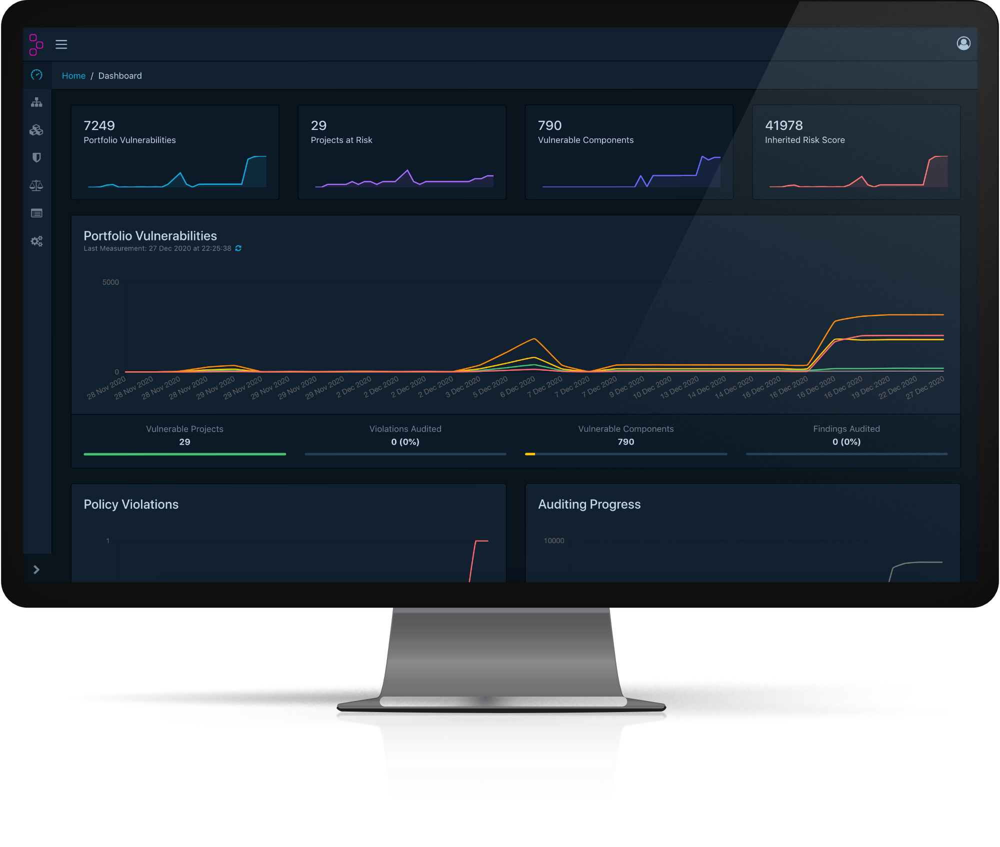

Dependency-Track is an intelligent [Supply Chain Component Analysis] platform that allows organizations to
identify and reduce risk from the use of third-party and open source components. Dependency-Track takes a unique
and highly beneficial approach by leveraging the capabilities of [Software Bill of Materials] (SBOM). This approach
provides capabilities that traditional Software Composition Analysis (SCA) solutions cannot achieve.

Dependency-Track monitors component usage across all versions of every application in its portfolio in order to
proactively identify risk across an organization. The platform has an API-first design and is ideal for use in
CI/CD environments.

## Features
* Tracks application, library, framework, operating system, container, firmware, and hardware components
* Tracks component usage across every application in an organizations portfolio
* Identifies multiple forms of risk including
  * Components with known vulnerabilities
  * Out-of-date components
  * Modified components
  * License risk
  * More coming soon...
* Integrates with multiple sources of vulnerability intelligence including:
  * [National Vulnerability Database] (NVD)
  * [NPM Public Advisories]
  * [Sonatype OSS Index]
  * [VulnDB] from [Risk Based Security]
  * More coming soon.
* Robust policy engine with support for global and per-project policies
  * Security risk and compliance
  * License risk and compliance
  * Operational risk and compliance
* Ecosystem agnostic with built-in repository support for:
  * Gems (Ruby)
  * Hex (Erlang/Elixir)
  * Maven (Java)
  * NPM (Javascript)
  * NuGet (.NET)
  * Pypi (Python)
  * More coming soon.  
* Includes a comprehensive auditing workflow for triaging results
* Configurable notifications supporting Slack, Microsoft Teams, Webhooks, and Email
* Supports standardized SPDX license ID’s and tracks license use by component
* Supports importing [CycloneDX] and [SPDX] Software Bill of Materials (SBOM) formats
* Easy to read metrics for components, projects, and portfolio
* Native support for Kenna Security, Fortify SSC, DefectDojo and ThreadFix
* API-first design facilitates easy integration with other systems
* API documentation available in OpenAPI format
* OAuth 2.0 + OpenID Connect (OIDC) support for single sign-on (authN/authZ)
* Supports internally managed users, Active Directory/LDAP, and API Keys
* Simple to install and configure. Get up and running in just a few minutes

[National Vulnerability Database]: https://nvd.nist.gov
[NPM Public Advisories]: https://www.npmjs.com/advisories
[Sonatype OSS Index]: https://ossindex.sonatype.org
[VulnDB]: https://vulndb.cyberriskanalytics.com
[Risk Based Security]: https://www.riskbasedsecurity.com
[Supply Chain Component Analysis]: https://owasp.org/www-community/Component_Analysis
[Software Bill-of-Materials]: https://owasp.org/www-community/Component_Analysis#software-bill-of-materials-sbom
[CycloneDX]: https://cyclonedx.org
[SPDX]: https://spdx.org/
